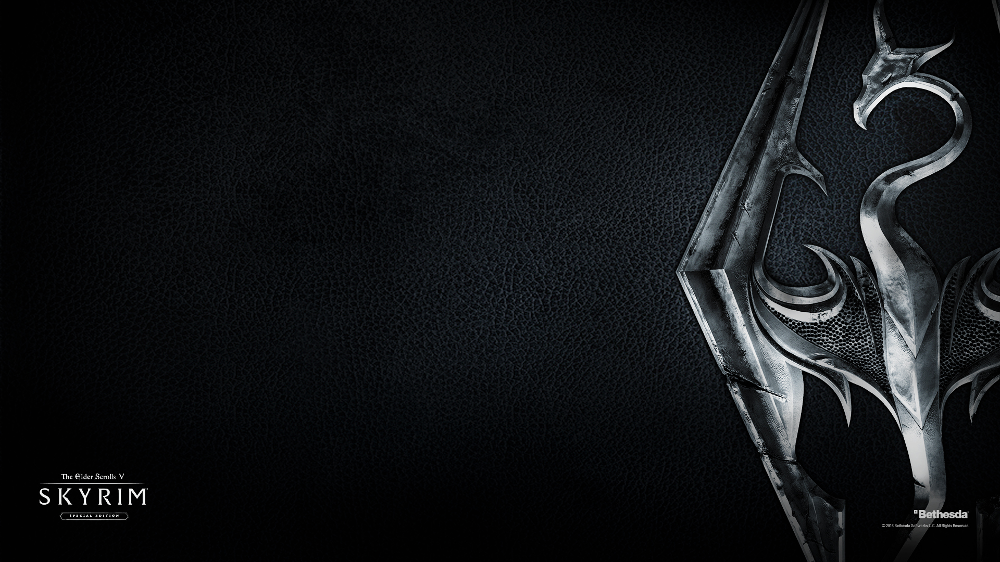

      
	

	

		<h2 class="page-header">Modlists</h2>
	

	

		

			

				
					<i class="fa fa-circle fa-stack-2x text-primary"></i>
					<i class="fa fa-tree fa-stack-1x fa-inverse"></i>
				
			

		 	

				<h4>Mythic Skyrim</h4>
			  	
A modlist for TESV: Skyrim Anniversary Edition.

			  	<a href="#" class="btn btn-primary">Learn More</a>
		  	

	  	

	


